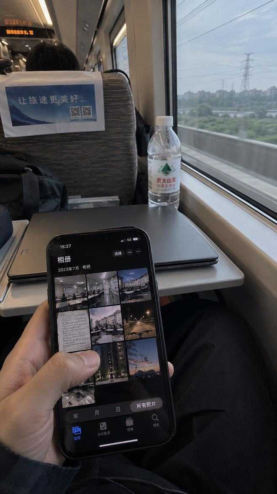
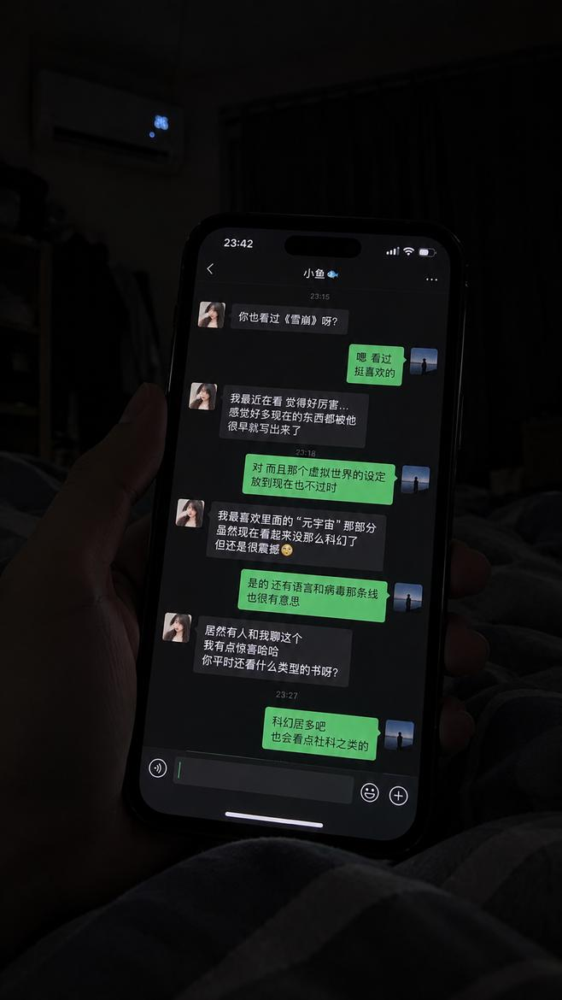
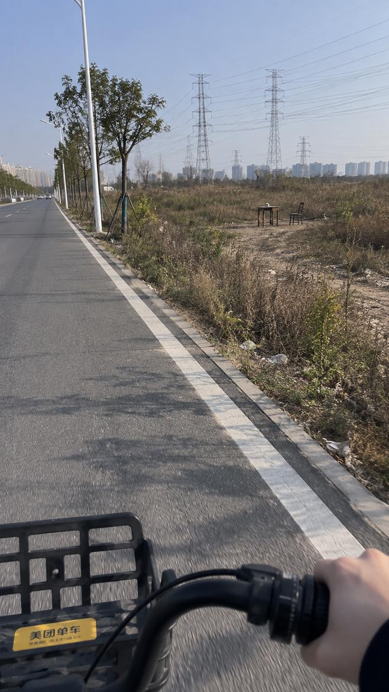
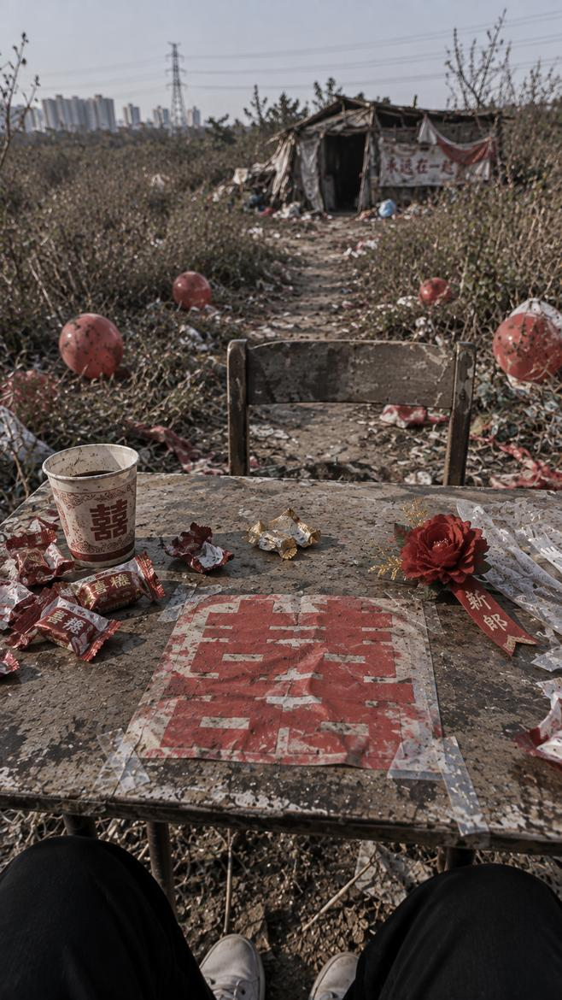
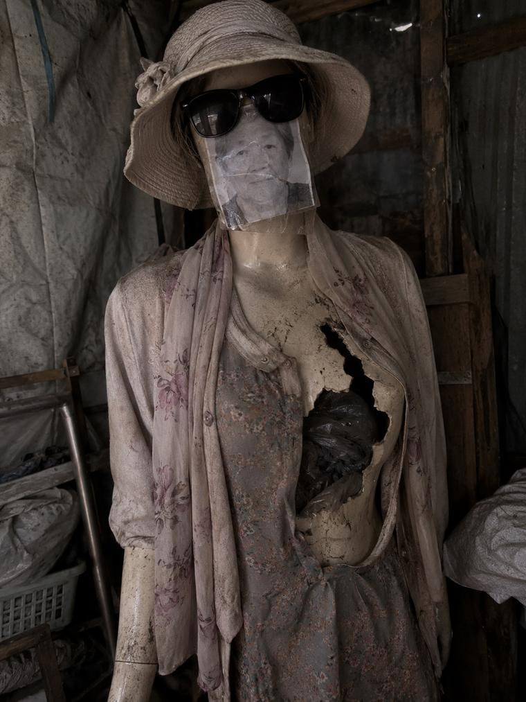
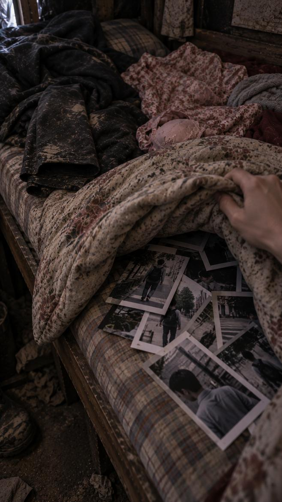
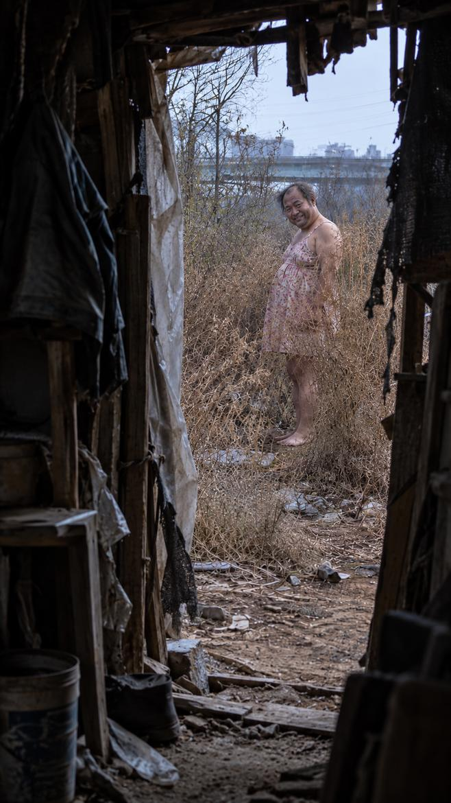

# 郊区网恋 / Suburban Online Romance

> 一个包含 35 张图片的第一视角 AI 视觉叙事案例：从普通备考生活出发，让线上关系留下的痕迹，逐步进入现实空间。

[项目中文主页](../../README_CN.md) · [Project Home](../../README.md) · [全部图片](shots/) · [逐镜头分析](storyboard.md)

## 故事起点

一个考研生与兴趣相投的网友逐渐亲近，却在提出见面后失去了联系。后来，他每天骑车经过的荒地里出现了桌椅，以及越来越像约会邀请的布置。

这些东西是谁放的？它们与那段已经中断的关系，有什么联系？

本案例关注的不只是结尾答案，更是观众如何从日常生活出发，逐渐注意到异常、观察物件、重新理解前面的信息。

**内容提示：** 悬疑、身份欺骗、跟踪、破旧假人及死亡相关道具。详细分析文件包含完整剧透；下面的结尾镜头默认折叠。

## 先看几张 / Visual Preview

| Shot 01 · 回忆入口                                           | Shot 12 · 共同兴趣                                           | Shot 21 · 第一次异常                                         |
| ------------------------------------------------------------ | ------------------------------------------------------------ | ------------------------------------------------------------ |
|  |  |  |
| 用普通出行场景引入往事。                                     | 用具体交流建立亲近感。                                       | 让熟悉道路旁出现一个小变化。                                 |

想先体验故事，可进入 [shots 图片目录](shots/)，按编号 1—35 查看。目录的默认排序未必是数字顺序，注意不要把第 10 张误当成第 2 张。

<!-- 图片路径依据提供的仓库目录截图：shots/1.jpg 至 shots/35.jpg。
本轮未连接 GitHub 核对实际文件名，也未重命名或转换图片。
如果仓库已改用 shot_001.jpg、PNG 等命名，请按真实路径修改下面的 src，勿只改扩展名而不核对文件。
-->

## 从哪里开始 / Reading Guide

初次学习建议按下表顺序阅读；如果正在排查某张图，也可以直接进入分镜与连续性记录。

| 顺序 | 文档                                                        | 主要解决的问题                                   |
| ---- | ----------------------------------------------------------- | ------------------------------------------------ |
| 1    | [idea.md — 故事构思](idea.md)                               | 核心谜题、隐藏真相、线索如何连接、异常为什么升级 |
| 2    | [story_bible.md — 设定档案](story_bible.md)                 | 人物、地点、道具应保持什么，哪些关系尚未确定     |
| 3    | [storyboard.md — 35 镜头拆解](storyboard.md)                | 每张图可见什么、承担什么任务、哪些含义仍需要推断 |
| 4    | [continuity_notes.md — 制作与返工记录](continuity_notes.md) | 当前问题、历史经验、修正优先级与验收方法         |

四份文档有不同分工：**构思想清关系，设定固定属性，分镜安排发现，连续性记录检查执行。**

## 这个案例适合研究什么

### 普通生活如何成为悬疑的基础

教室、骑车路线、住处和手机交流先建立主角的生活。异常后来进入这些空间，而不是立即把故事带到完全陌生的恐怖世界。

这是一种设计选择，不意味着所有故事都需要二十张日常铺垫。日常镜头也要有明确的人物、空间或情绪作用。

### 线索怎样改变旧信息的意义

聊天中的话语、礼物与反复出现的物件，让后半段可以回应前半段。观众有机会先形成一种解释，再发现它不够用了。

这需要物件真正可辨认。作者知道两张图里是同一件礼物，不代表观众会自动建立联系。

### 第一视角怎样安排发现

远远看见、主动走近、坐到桌边、进入棚屋、检查物件，各自提供不同的可见范围。镜头可以推进信息，也可以建立空间、情绪或停顿，不必每张都新增一个事实。

### 怎样记录不完美的制作过程

文档区分作者设定、画面事实与观众推断，也区分历史返工记录和当前问题。它不是“35 张图全部无误”的展示报告，更不是保证传播效果的配方。

## 结构速览 / Story Structure

| 阶段                       | 镜头  | 主要任务                     |
| -------------------------- | ----- | ---------------------------- |
| ACT 0 · 现在时入口         | 01–03 | 从高铁相册进入回忆           |
| ACT 1 · 日常与关系         | 04–17 | 建立备考生活、交流和礼物线索 |
| ACT 2 · 关系中断           | 18–20 | 未获回应、等待、回到学习     |
| ACT 3 · 异常出现           | 21–23 | 桌椅持续存在，加入引导意味   |
| ACT 4 · 邀请路线           | 24–28 | 深入荒地，感情符号逐渐升级   |
| ACT 5 · 私人空间           | 29–31 | 建立室内空间，逐个检查物件   |
| ACT 6 · 身份线索与个人威胁 | 32–34 | 让发现与主角自身连接         |
| ACT 7 · 真人揭示           | 35    | 新身份信息与此前线索汇合     |

详细文档统一采用 L0–L9 表示本案例的异常推进阶段；它不是客观危险评分，也不是观众理解程度的百分比。

## 后半段精选 / Spoiler Gallery

展开：后半段镜头与结尾解析（完整剧透）

| Shot 28 · 路线终点                                           | Shot 30 · 假人细节                                           |
| ------------------------------------------------------------ | ------------------------------------------------------------ |
|  |  |
| 感情符号升级，并给出下一处空间。                             | 展示形象投射与配饰线索，不直接确定贴照人物身世。             |

| Shot 34 · 与主角有关的照片                                   | Shot 35 · 真人出现                                           |
| ------------------------------------------------------------ | ------------------------------------------------------------ |
|  |  |
| 按作者设定，照片拍的是主角；画面需要帮助观众认出他。         | 按作者设定，他是账号使用者，身穿主角送出的裙子。             |

### 作者设定与表达边界

账号实际使用者是住在棚屋、具有建筑或工地工作背景的中年男性。他接收了礼物，持续观察主角，并布置引导路线。被子下的照片与最后的裙子用于把这些关系接起来。

图片没有逐项直接证明全部经过，因此分析文件会区分“作者确定的真相”和“画面已经清楚表达的内容”。例如，年长女性照片不等于年轻女孩头像，其与主人的具体关系没有在本轮中补写。

结尾既首次展示真人外貌，也让前面的线索汇合。危险来自欺骗、跟踪和定向引导，而不是人物的职业、体型或穿裙子本身。

### 当前仍需处理的重点

- **人物照片辨认：** 前期缺少主角正脸信息，Shot 34 可能需要简短叙述或已建立的外观特征辅助。
- **礼物连续性：** Shot 16–17 与 Shot 35 的裙装有差异，同一件礼物的回收还需视觉支撑。
- **账号和设备：** 头像、手机顶部外观、名称关系及消息时间仍有待统一或核对。
- **画幅和空间：** 当前 Shot 29、30 原图为 3:4，目标为 9:16；部分道路地标细节仍需检查。

这些问题已有记录和处理建议，**不代表图片已经修复**。详细清单见 [continuity_notes.md](continuity_notes.md)。

## 怎样把方法用到自己的故事

不要照搬本案例的假人、棚屋或身份反转。可以尝试：

1. 写下一个普通生活场景和一个小异常。
2. 确定异常背后的核心真相，列出它会留下的几种痕迹。
3. 为早期线索安排一种合理的表面解释。
4. 设计三至五个发现步骤，让物件或关系的意义逐渐改变。
5. 为每张图指定主要任务，再检查人物、道具和空间是否连续。
6. 请未读设定的人说明他们看懂了什么、依据是什么，再决定改哪里。

最后一步是建议的测试方法，不是本案例已完成观众测试的声明。

可使用项目中的 [故事构思模板](../../templates/story_idea_template.md)、[设定模板](../../templates/story_bible_template.md)、[分镜模板](../../templates/storyboard_template.md)、[单镜头提示词模板](../../templates/shot_prompt_template.md) 与 [连续性检查表](../../templates/continuity_checklist.md)。模板仍可继续改进，案例中的具体状态以本目录新版文档为准。

## 文件与当前状态

| 路径                  | 内容                           |
| --------------------- | ------------------------------ |
| `README.md`           | 案例入口、精选图片和阅读导航   |
| `idea.md`             | 构思、谜题、隐藏真相与线索设计 |
| `story_bible.md`      | 人物、地点、道具及制作要求     |
| `storyboard.md`       | 全部 35 镜头的分析             |
| `continuity_notes.md` | 连续性问题与返工方法           |
| `shots/`              | 图片序列                       |

当前包含完整的 35 张图片序列与四份分析文档；本轮完成文档校订。图片修复、完整跨镜头验收及陌生观众测试不在此次已完成范围内。本页未提供可核验的成片链接，也不宣称已交付完整视频制作教程或全部原始提示词。

图片引用按所提供目录截图中的 `shots/1.jpg`—`shots/35.jpg` 编写，精选镜头直接引用该目录，不要求另建 `selected_shots/`。若实际仓库已更名为 `shot_001` 等格式，请先核对文件名、扩展名及大小写，再同步本页路径；此次未连接远程仓库验证图片链接。

## English Summary

**Suburban Online Romance** is a 35-image, predominantly first-person AI visual storytelling case study. An exam candidate loses contact with an online acquaintance, then notices an increasingly deliberate arrangement of tables along his usual cycling route.

The Chinese case documents cover narrative design, character/location/prop continuity, shot-by-shot analysis, and revision methods. They distinguish author-defined story facts from visible evidence and audience inference. The case includes known production limitations; it is not a claim that every image is continuity-perfect or that audience outcomes have been measured.

Start with [Story Idea](idea.md), then [Story Bible](story_bible.md), [Storyboard](storyboard.md), and [Continuity Notes](continuity_notes.md). These documents contain full spoilers. The gallery above hides the ending until expanded. Image paths follow the supplied directory screenshot and have not been verified against the remote repository.

## License

Unless otherwise stated, the original documentation in this case study follows the repository-level license. See [LICENSE](../../LICENSE) for the applicable terms. This page does not change the scope of that license.

> 让普通物件留下可以辨认的联系，让后来的发现改变先前的理解。
